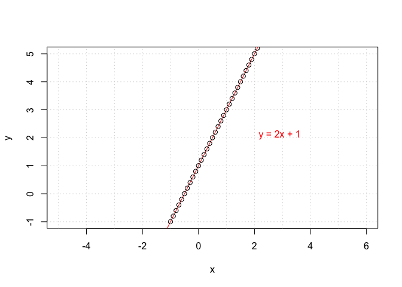
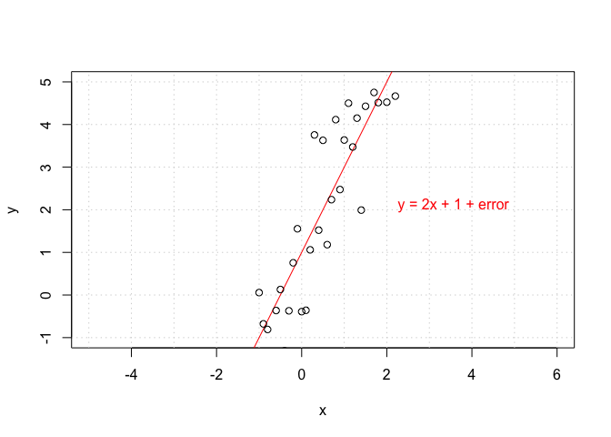
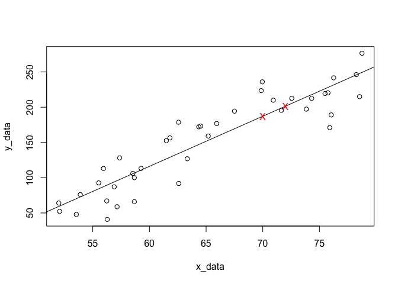
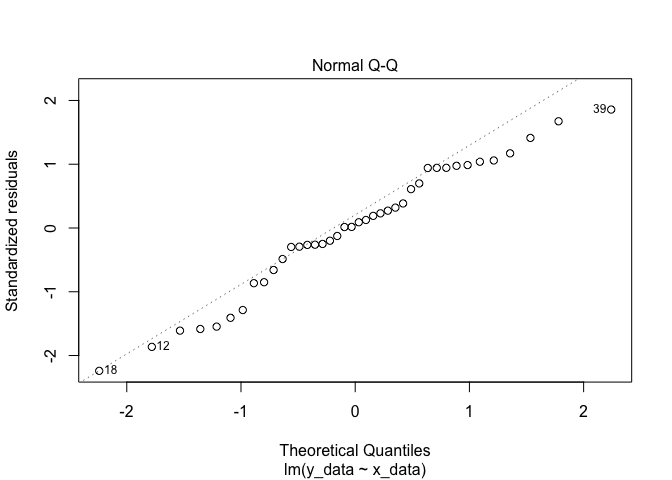
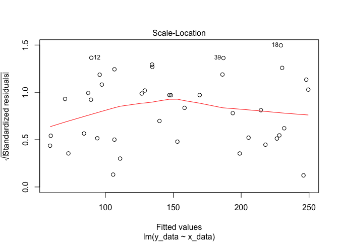
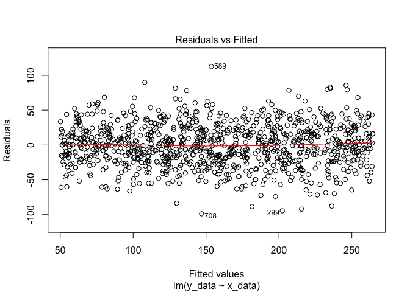
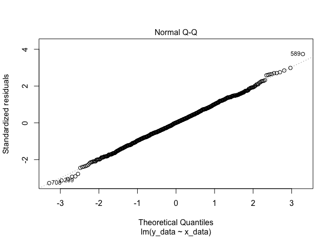
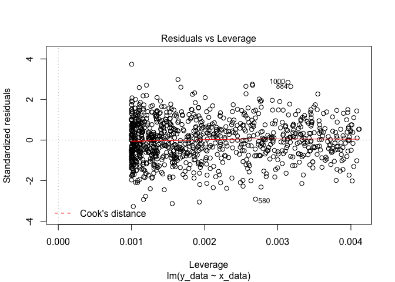

Linear regression workshop for HGSS
================
Alex Diaz-Papkovich
December 3, 2019

## Introduction

Regression is a set of methods to measure and estimate the relationship
between variables. The idea is your data will “regress” to some
function. The focus of this workshop is linear regression, one of the
most effective and widely-used statistical tools. The idea is that for
each observation, you have some outcome that depends on other variables,
and this relationship can be expressed as a linear equation,
\(y = \beta_0 + \beta_1x_1 + \beta_2x_2 + \dots + \beta_{p}x_{p} + noise\).

Why linear regression? Because it’s:

  - interpretable
  - easy to implement
  - got good statistical properties
  - robust

Linear regression works when you are modeling continuous data (i.e. not
binary or categorical data), and when you have a handful of predictors.
If you have \(p\) predictors and \(n\) samples, we assume that
\(p << n\). If your data does not fall into these regimes, linear
regression will not work. To deal with these scenarios, we can extend
the ideas of linear regression to formulate *generalized linear models*
(a family of models containing logistic regression and Poisson
regression) and penalized/regularized regression like LASSO and ridge
regression. Here, we will focus on simple cases where linear regression
works.

Linear regression is extremely powerful and is regularly used in every
type of analysis across scientific fields. A GWAS, for example, is just
a series of linear regression models carried out on a set of SNPs, where
we assume a phenotype \(y\) can be modelled by the number of alleles at
each SNP \(S\), \(x\), i.e. \(y = \beta_{0} + \beta_{S}x\). Note that
this is simply a measurement of association between variables – linear
regression will \*not\*\* determine whether there is a causal
relationship between variables, though it is one of the tools that can
add to evidence of causality.

### Formulation

There are a few basic assumptions that you must make when doing linear
regression.

The first assumption is that your data are related by a *linear
relationship*, that is, it can be expressed as a linear equation. In the
simplest case, we take the equation of a line, \(y=mx + b\), where we
know what the \(y\) and \(x\) values are and estimate the values of the
slope \(m\) and intercept \(b\). For easier notation, we typically
denote the intercept as \(\beta_0\) and the slope as \(\beta_1\) and
rearrange the equation as: \[y=\beta_{0} + \beta_{1}x\]

<!-- -->

We will (hopefully\!) have more than one value for each \((x,y)\) pair,
so we denote each observation \((x_i,y_i)\). If we have \(N\) samples,
then \(i\) takes the values \(1 \dots N\), so our data are described as
the collection of observations \((x_1,y_1)\dots(x_N,y_N)\). Given this
set of data, our model is now:
\[y_i = \beta_{0} + \beta_{1}x_{i} \text{ , for } i = 1 \dots N\]

<!-- -->

Finally, we need to add noise to our model. Our observations will never
be perfect, so we have to build this error into the model. The errors
are denoted by \(\epsilon_{i}\), and we assume that they independently
follow the same Normal distribution centred around \(0\) and with a
constant variance, \(\sigma^{2}\). This is written as
\(\epsilon_{i} \stackrel{iid}{\sim}N(0,\sigma^{2})\). Now, our model
looks like:
\[y_i = \beta_{0} + \beta_{1}x_{i} + \epsilon_{i} \text{ , for } i = 1 \dots N \text{ , } \epsilon_{i} \stackrel{iid}{\sim}N(0,\sigma^{2})\]
<!-- -->

There are several assumptions with this approach:

  - The errors are *random*
  - The errors are *independent* (\(\implies\) uncorrelated)
  - The errors are *normally distributed*
  - The errors have *mean zero*
  - The errors have *the same variance* (homoscedasticity)

#### How do we estimate \(\beta\)?

Here we started with a linear equation and generated our data. In real
life, we have our data and need to estimate the linear equation. Given
our observations \((x_i,y_i)\), we want to estimate \(\beta_0\) and
\(\beta_1\), denoted as \(\hat{\beta_j}\) for \(j=0,1\). The value of
\(\hat\beta_1\) is the estimate of the unit-change between \(x_i\) and
\(y_i\). For example, if our \(y\) values are a person’s weight (in kg)
and our \(x\) values are height (in cm), then \(\hat{\beta_1}\) is the
estimate of how much somebody’s weight in kg increases for a 1cm change
in height.

One logical approach to estimate the values of the \(\beta\)s is in a
way that would make the errors, or equivalently sum of their squares, as
small as possible. This is the **ordinary least squares** estimator.

\[y_i = \beta_{0} + \beta_{1}x_{i} + \epsilon_{i}
\\ \text{rearranged as: } \epsilon_i = y_i - \beta_{0} - \beta_{1}x_{i}
\] If we have \(N\) observations, then the sum of the squared errors is
\[\sum_{i}^{N}\epsilon_{i}^{2} = \sum_{i}^{N}(y_{i} - \beta_{0} - \beta_{1}x_{i})^{2} = SSE\]

Geometrically, we are drawing squares on our regression plot: for each
observation \(i\), the square has sides of length \(\epsilon_i\) (the
distance between the point and the regression line) and area
\(\epsilon_i^2\). The goal of the least squares estimator is to make the
sum of the areas of these squares as small as possible. For an intuitive
animation, [see this web
page](http://setosa.io/ev/ordinary-least-squares-regression/).

Using some calculus, the estimates of the \(\beta\)s turn out to
be:

\[\hat{\beta_1} = \frac{\sum^{N}_{i=1}(x_{i} - \bar{x})(y_{i} - \bar{y})}
                  {\sum_{i=1}^{N}(x_{i} - \bar{x})^{2}} = \frac{SS_{xy}}{SS_{xx}}\]

\[\hat{\beta_0} = \bar{y} - \hat{\beta_{1}}\bar{x}\]

Because of the assumptions we made earlier, our estimators have some
very nice statistical properties. If our errors are uncorrelated and
have mean zero and are homoscedasticity, then our estimates are the best
linear unbiased estimator. Being unbiased means that the estimator of
\(\beta\), on average, the true value of the \(\beta\). Being the “best”
estimator means it has the lowest variance of all linear unbiased
estimators. There are numerous websites and textbooks that discuss
derivations of estimates in great detail.

### Notation and terminology

Models are usually written in matrix notation for convenience. So far we
have worked with one continuous \(y\) variable and one continuous \(x\)
variable. This is called **simple linear regression**. The matrix
formulation of simple linear regression is:

\[Y = \begin{pmatrix}
y_1 \\ y_2 \\ \dots \\ y_N
\end{pmatrix}, X =
\begin{pmatrix}
1 & x_{1} \\ 1 & x_{2} \\ \dots & \dots \\ 1 & x_{N}
\end{pmatrix},
\beta = \begin{pmatrix}
\beta_{0} \\ \beta_{1}
\end{pmatrix},
\epsilon = \begin{pmatrix}
\epsilon_{1} \\ \epsilon_{2} \\ \dots \\ \epsilon_{N}
\end{pmatrix}\]
\[Y = \beta X + \epsilon, \epsilon_{i} \stackrel{iid}{\sim}N(0,\sigma^{2})\]

There are many terms used to describe the variables and types of models
used. This is a brief reference.

  - Independent variable, regressor, feature, explanatory variable, etc:
    These are all terms for your \(x\) variables.
  - Dependent variable, regressand, target, outcome, response, etc:
    These are all terms for your \(y\) variable, which you are modeling
    using your \(x\) variables
  - Simple/single linear regression: The simplest regression model,
    \(y_i = \beta_0 + x_i \beta_1 + \epsilon_i\)
  - Multiple linear regression: Linear regression with multiple
    independent variables,
    \(y_i = \beta_0 + x_{i,1}\beta_{1} + x_{i,2}\beta_{2} + \dots + x_{i,p}\beta_{p} + \epsilon_i\).
  - Multivariate linear regression: Linear regression with multiple
    dependent (response) variables that share a covariance structure,
    \(Y_{ij} = \beta_{0j} + \beta_{1j}X_{i1} + \dots + \beta_{pj}X_{ip} + \epsilon_{ij}\)
    for observations \(i=1, \dots, N\) and dependent variables
    \(j = 1, \dots,m\). We won’t go into this in this workshop, but it’s
    useful for when you want to simultaneously model related outcomes,
    such as multiple phenotypes given a shared input, like gene
    expression levels.

As an aside, this is why it’s important to know, mathematically, what
your model looks like. Using ambiguous terms makes it tedious to
understand and/or replicate research and results.

## Linear regression in R

### Simple linear regression

Most scientific programming languages have built-in linear regression.
In R, linear models are constructed with the `lm` function. The general
format is:

`my_model <- lm(y ~ x1 + x2 + ... xp, data = my_data)`

As an example, let’s generate some data and run a regression on it.

``` r
set.seed(20191203) # set a seed for reproducibility

# lets set up some true data
b0 <- -300 # true beta_0
b1 <- 7 # true beta_1
N <- 40 # sample size

# generate some x values, let's pretend it's height in inches
# a sample of size N bounded between 50 and 80
x_data <- runif(N,50,80)

# generate some random normal errors
errs <- rnorm(N, mean = 0, sd = 30)

y_data <- b0 + x_data*b1 + errs
```

The first thing you should do is **look at your data**. This should give
you some idea of whether your data are linearly
related.

``` r
plot(x_data, y_data)
```

<!-- -->

Note that the data is still kind of noisy – this is fine, as data is not
always clearly linearly related. However, if you saw other shapes (like
parabolas, exponential growth, or periodicity), then the linear model
would need some changes. Moving on, we code our model as:

``` r
my_model <- lm(y_data ~ x_data)
```

To look at the results of our model, we use the `summary` function.

``` r
summary(my_model)
```

    ## 
    ## Call:
    ## lm(formula = y_data ~ x_data)
    ## 
    ## Residuals:
    ##     Min      1Q  Median      3Q     Max 
    ## -58.154 -13.992   1.414  24.988  49.085 
    ## 
    ## Coefficients:
    ##              Estimate Std. Error t value Pr(>|t|)    
    ## (Intercept) -310.4223    33.3369  -9.312 2.38e-11 ***
    ## x_data         7.1091     0.5088  13.972  < 2e-16 ***
    ## ---
    ## Signif. codes:  0 '***' 0.001 '**' 0.01 '*' 0.05 '.' 0.1 ' ' 1
    ## 
    ## Residual standard error: 26.89 on 38 degrees of freedom
    ## Multiple R-squared:  0.8371, Adjusted R-squared:  0.8328 
    ## F-statistic: 195.2 on 1 and 38 DF,  p-value: < 2.2e-16

What’s going on in this output?

    Call:
    lm(formula = y_data ~ x_data)

The first part shows the formula R used to run the analysis.

    Residuals:
        Min      1Q  Median      3Q     Max 
    -58.154 -13.992   1.414  24.988  49.085 

This portion is a summary of the residuals (errors). We’ll follow up
later.

    Coefficients:
                 Estimate Std. Error t value Pr(>|t|)    
    (Intercept) -310.4223    33.3369  -9.312 2.38e-11 ***
    x_data         7.1091     0.5088  13.972  < 2e-16 ***
    ---
    Signif. codes:  0 ‘***’ 0.001 ‘**’ 0.01 ‘*’ 0.05 ‘.’ 0.1 ‘ ’ 1

The coefficients are the meat of the analysis. They are our slopes and
intercept. The estimate for our intercept is
\(\hat{\beta_{0}} = -310.4223\) and for the slope is
\(\hat{\beta_1} = 7.1091\). Recall our original values when generating
the data were \(-300\) and \(7\), respectively, so this is pretty good\!

The standard error refers to the standard error for the estimate of
particular \(\beta\) value. In this case, the standard error around the
slope is \(0.5088\), and the standard error around the intercept is
\(33.3369\). Next we have the t-statistic and p-value for each
\(\beta\). Note that the t-statistic is the estimate divided by the
standard error, and the p-value is the probability that the t-statistic
is drawn at random from a student’s t-distribution with \(N-p-1\)
degrees of freedom, where \(p\) is the number of independent variables.
In principle you could calculate these values yourself… but that’s what
software is for.

Moving on, although we have estimates of our \(\beta\) values, we’d also
like to know how likely it is that it’s actually zero (perhaps the
standard deviations are so large that \(\beta\) could plausibly be
\(0\)). So for each slope, using the aforementioned t-statistic, we are
testing:

\[H_{0}: \beta_{i} = 0 \text{ vs. } H_{A}: \beta_i \ne 0\]

In this case our p-value falls below \(0.05\) for both \(\beta_0\) and
\(\beta_1\), so we reject the null hypothesis in each case. That is, our
slopes are non-zero. If you run an analysis with multiple \(\beta\)s,
you will need to asses the significance of each slope and remove those
that do not appear to be significant.

    Residual standard error: 26.89 on 38 degrees of freedom
    Multiple R-squared:  0.8371,    Adjusted R-squared:  0.8328 
    F-statistic: 195.2 on 1 and 38 DF,  p-value: < 2.2e-16

The residual standard error is the average amount that the predicted
variable will deviate from the fitted line. So on average, our \(y\)
values will be about \(26.89\) away from the line.

The multiple \(R^2\) is the squared Pearson correlation coefficient, and
the adjusted \(R^2\) is a version that adjusts for the number of
parameters. It is usually bounded between \(0\) and \(1\), and is the
proportion of variance explained by your model – the closer your model
is to \(1\), the better of a fit your model is. However, adding more and
more variables just to get a better \(R^2\) value is discouraged as it
leads to model overfitting. Remember, the goal is to explain
relationships your data, and not to meet some arbitrary threshold\!

The F-statistic tests the hypothesis that *all* of your non-intercept
\(\beta\) values are \(0\), ie:
\[H_0: \beta_1 = \dots = \beta_p = 0 \text{ vs. } H_A:\text{At least one slope is not zero}\]
If your F-statistic is non-significant, your model has serious issues as
none of your predictors are useful\! In this case it’s a moot point as
we only have one slope anyway.

We can visualize what the model looks like:

``` r
plot(x_data, y_data)
abline(my_model)
```

<!-- -->

### Multiple variables

Often we want to test multiple variables. Luckily, this is
straightforward to do – we simply add more variables to our model and
carry out the rest of the tests as intended. Mathematically, we have:
\[y_i = \beta_0 + \beta_1x_{i1} + \beta_{2}x_{i2} + \epsilon_{i}\]

``` r
set.seed(20191203) # set a seed for reproducibility

# lets set up some true data
b0 <- -300 # true beta_0
b1 <- 7 # true beta_1
b2 <- -12 # true beta_2
N <- 40 # sample size

# generate some x values again
x1_data <- runif(N,50,80)
x2_data <- runif(N,10,20)

# generate some random normal errors
errs <- rnorm(N, mean = 0, sd = 30)

y_data <- b0 + x1_data*b1 + x2_data*b2 + errs
```

In this case, we’ve created our \(y\) variable as a linear combination
of two variables (\(x1\) and \(x2\)). Lets code this in R and see what
the results are. To begin, we’ll put our data into a dataframe – so far
we’ve only worked with vectors. Generally you’ll be working with
dataframes (or some equivalent if you’re working in another language),
which are easier to manage. The results will be the same, but slightly
easier to follow

``` r
# put the data into a dataframe

my_data <- data.frame(y_data, x1_data, x2_data) # put the data into a frame
colnames(my_data) <- c("y","x1","x2") # give names to our variables

my_model_2 <- lm(y ~ x1 + x2, data = my_data) # set up the model
summary(my_model_2) # output the analysis
```

    ## 
    ## Call:
    ## lm(formula = y ~ x1 + x2, data = my_data)
    ## 
    ## Residuals:
    ##     Min      1Q  Median      3Q     Max 
    ## -56.478 -16.155   0.116  14.658  54.134 
    ## 
    ## Coefficients:
    ##              Estimate Std. Error t value Pr(>|t|)    
    ## (Intercept) -253.3287    40.1480  -6.310 2.39e-07 ***
    ## x1             6.0382     0.5001  12.075 2.12e-14 ***
    ## x2           -11.0692     1.4557  -7.604 4.52e-09 ***
    ## ---
    ## Signif. codes:  0 '***' 0.001 '**' 0.01 '*' 0.05 '.' 0.1 ' ' 1
    ## 
    ## Residual standard error: 26.42 on 37 degrees of freedom
    ## Multiple R-squared:  0.849,  Adjusted R-squared:  0.8408 
    ## F-statistic:   104 on 2 and 37 DF,  p-value: 6.471e-16

The estimates are:

  - \(\hat{\beta_0} = -253.3287\) (\(\beta_0 = -300\))
  - \(\hat{\beta_{1}} = 6.0382\) (\(\beta_1 = 7\))
  - \(\hat{\beta_{2}} = -11.0692\) (\(\beta_2 = -12\))

The results are close. As an exercise, let’s see what happens if we
raise the sample size to something huge, say, \(10,000\).

``` r
set.seed(20191203) # set a seed for reproducibility

# lets set up some true data
b0 <- -300 # true beta_0
b1 <- 7 # true beta_1
b2 <- -12 # true beta_2
N <- 10000 # sample size

# generate some x values again
x1_data <- runif(N,50,80)
x2_data <- runif(N,10,20)

# generate some random normal errors
errs <- rnorm(N, mean = 0, sd = 30)

y_data <- b0 + x1_data*b1 + x2_data*b2 + errs

my_model_3 <- lm(y_data ~ x1_data + x2_data)
summary(my_model_3)
```

    ## 
    ## Call:
    ## lm(formula = y_data ~ x1_data + x2_data)
    ## 
    ## Residuals:
    ##      Min       1Q   Median       3Q      Max 
    ## -116.602  -19.806    0.155   19.892  112.635 
    ## 
    ## Coefficients:
    ##               Estimate Std. Error t value Pr(>|t|)    
    ## (Intercept) -299.24504    2.72770  -109.7   <2e-16 ***
    ## x1_data        6.97908    0.03451   202.2   <2e-16 ***
    ## x2_data      -11.96075    0.10307  -116.0   <2e-16 ***
    ## ---
    ## Signif. codes:  0 '***' 0.001 '**' 0.01 '*' 0.05 '.' 0.1 ' ' 1
    ## 
    ## Residual standard error: 29.84 on 9997 degrees of freedom
    ## Multiple R-squared:  0.8436, Adjusted R-squared:  0.8435 
    ## F-statistic: 2.695e+04 on 2 and 9997 DF,  p-value: < 2.2e-16

So as the sample size gets bigger, the estimates of the \(\beta\) values
get much closer to the true value\!

We can also visualize this regression, although since we’ve got an extra
dimension, we are now fitting a plane in 3D space, as opposed to a line
in 2D space.

``` r
set.seed(20191203) # set a seed for reproducibility

# lets set up some true data
b0 <- -300 # true beta_0
b1 <- 7 # true beta_1
b2 <- -12 # true beta_2
N <- 100 # sample size

# generate some x values again
x1_data <- runif(N,50,80)
x2_data <- runif(N,10,20)

# generate some random normal errors
errs <- rnorm(N, mean = 0, sd = 30)

y_data <- b0 + x1_data*b1 + x2_data*b2 + errs

my_model_3 <- lm(y_data ~ x1_data + x2_data)

library(scatterplot3d) # load the library for visualization - you may need to install this
plot3d <- scatterplot3d(cbind.data.frame(x1_data,x2_data,y_data), angle=55)
plot3d$plane3d(my_model_3)
```

<!-- -->

Unfortunately we can’t perceive beyond three dimensions. But for now,
this will do.

### Categorical data

Categorical data is measured through *dummy variables*. These take on
binary values, {0,1}, and are mutually exclusive. Common example include
sex and treatment/control. When using multiple values of a categorical
value (e.g. Control, Treatment1, Treatment2, etc), you must create one
dummy variable per category. In R, you can do this automatically using
the `factor` function. The results of regression will be relative to
some reference group. For example, if you code for sex, then the
estimated \(\beta\) will be the difference in averages for males
relative to females, without loss of generality. Our model
is:

\[y_i = \beta_0 + \beta_1x_{i} + \epsilon_{i} \text{ ,where } x_{i}=\{0,1\}\]

Lets simulate some more data again, this time from two groups.

``` r
set.seed(20191203) # set a seed for reproducibility

ng <- 2 # number of groups
N <- 40 # sample size

# values of the true betas
b0 <- 10
b1 <- -5

group <- rep( c("group1", "group2"), each = N) # create the two sets of groups
errs <- rnorm(ng*N, 0, sd=10) # create the standard errors

y_data <- b0 + b1*(group=="group2") + errs # those in group 2 are multiplied by b1
my_model_cat <- lm(y_data ~ as.factor(group)) # define the linear model
summary(my_model_cat)
```

    ## 
    ## Call:
    ## lm(formula = y_data ~ as.factor(group))
    ## 
    ## Residuals:
    ##      Min       1Q   Median       3Q      Max 
    ## -20.2230  -5.7237   0.0126   7.0784  19.6157 
    ## 
    ## Coefficients:
    ##                        Estimate Std. Error t value Pr(>|t|)    
    ## (Intercept)              10.125      1.409   7.187 3.47e-10 ***
    ## as.factor(group)group2   -5.616      1.992  -2.819  0.00611 ** 
    ## ---
    ## Signif. codes:  0 '***' 0.001 '**' 0.01 '*' 0.05 '.' 0.1 ' ' 1
    ## 
    ## Residual standard error: 8.911 on 78 degrees of freedom
    ## Multiple R-squared:  0.09245,    Adjusted R-squared:  0.08081 
    ## F-statistic: 7.946 on 1 and 78 DF,  p-value: 0.006107

Once again, we retrieve pretty good estimates of our true \(\beta\)
values.

### Relationship to other statistical tests

Pausing to think for a moment… what are we testing? We assume our data
comes from two distributions, and that the means between these
distributions are different, i.e., their difference is not zero. We can
visualize this via (for example) a
boxplot:

``` r
plot(factor(group), y_data)
```

<!-- -->

In fact, if we run a t-test instead of a regression model, we actually
retrieve the same estimates we had before:

``` r
group1_data <- y_data[1:40]
group2_data <- y_data[41:80]

t.test(group1_data, group2_data) # full t-test
```

    ## 
    ##  Welch Two Sample t-test
    ## 
    ## data:  group1_data and group2_data
    ## t = 2.8188, df = 77.926, p-value = 0.006108
    ## alternative hypothesis: true difference in means is not equal to 0
    ## 95 percent confidence interval:
    ##  1.649618 9.583172
    ## sample estimates:
    ## mean of x mean of y 
    ## 10.125180  4.508785

``` r
print("Estimated difference between groups:")
```

    ## [1] "Estimated difference between groups:"

``` r
print((t.test(y_data[41:80], y_data[1:40])$estimate[1] - 
  t.test(y_data[41:80], y_data[1:40])$estimate[2])) # estimated difference
```

    ## mean of x 
    ## -5.616395

Basically every statistical test can be rewritten in terms of a linear
model\! There is an excellent intro available
[here](https://lindeloev.github.io/tests-as-linear/).

### Continuous and categorical data

Using the above, we can combine categorical and continuous data into one
model. We will treat \(x_1\) as continuous and \(x_2\) as categorical.

``` r
set.seed(20191203) # set a seed for reproducibility

# lets set up some true data
b0 <- -300 # true beta_0
b1 <- 7 # true beta_1
b2 <- -30 # true beta_2
N <- 100 # sample size

# generate some x values again
x1_data <- runif(N,50,80) # generate continuous data
x2_data <- c(rep(1,N/2), rep(0,N/2)) # generate binary data

# generate some random normal errors
errs <- rnorm(N, mean = 0, sd = 30)

y_data <- b0 + x1_data*b1 + x2_data*b2 + errs

my_model_cont_cat <- lm(y_data ~ x1_data + x2_data)
summary(my_model_cont_cat)
```

    ## 
    ## Call:
    ## lm(formula = y_data ~ x1_data + x2_data)
    ## 
    ## Residuals:
    ##     Min      1Q  Median      3Q     Max 
    ## -88.564 -16.303  -0.775  18.868  58.340 
    ## 
    ## Coefficients:
    ##              Estimate Std. Error t value Pr(>|t|)    
    ## (Intercept) -268.5891    22.8445  -11.76  < 2e-16 ***
    ## x1_data        6.4711     0.3488   18.55  < 2e-16 ***
    ## x2_data      -28.8779     5.7635   -5.01 2.44e-06 ***
    ## ---
    ## Signif. codes:  0 '***' 0.001 '**' 0.01 '*' 0.05 '.' 0.1 ' ' 1
    ## 
    ## Residual standard error: 28.68 on 97 degrees of freedom
    ## Multiple R-squared:  0.7851, Adjusted R-squared:  0.7807 
    ## F-statistic: 177.2 on 2 and 97 DF,  p-value: < 2.2e-16

We would read this output as before. Let’s visualize what we’re looking
at.

``` r
library(ggplot2)# we'll use ggplot for plotting here

set.seed(20191203) # set a seed for reproducibility

# lets set up some true data
b0 <- -300 # true beta_0
b1 <- 7 # true beta_1
b2 <- -30 # true beta_2
N <- 100 # sample size

# generate some x values again
x1_data <- runif(N,50,80) # generate continuous data
x2_data <- c(rep(1,N/2), rep(0,N/2)) # generate binary data

# generate some random normal errors
errs <- rnorm(N, mean = 0, sd = 30)

y_data <- b0 + x1_data*b1 + x2_data*b2 + errs

# put together a data frame
my_data <- data.frame(y_data, x1_data, factor(x2_data))
colnames(my_data) <- c("y", "x1", "x2")

# generate a linear model
my_model_cont_cat <- lm(y ~ x1 + x2, data = my_data)

p <- ggplot(data = my_data, aes(y = y, x = x1, colour = x2)) +
  geom_point() +
  geom_abline(intercept = coef(my_model_cont_cat)[1], slope = coef(my_model_cont_cat)[2], colour="#F8766D") +
  geom_abline(intercept = coef(my_model_cont_cat)[1] + coef(my_model_cont_cat)[3],
              slope = coef(my_model_cont_cat)[2], colour = "#00BFC4")

p
```

<!-- -->

Depending on whether the data belongs to one category or another (sex or
treatment, for example), the regression line is pushed up or down
depending on the estimate of the appropriate \(\beta\).

### Prediction

Imagine we have some input data and want to predict its value according
to our model. Mathematically, this is straightforward. If we have our
estimates of \(\beta\) values, then we just plug it in. That is, we take
our inputs and map them to the regression line we’ve drawn. The equation
is,
\[y_{predicted} = \hat{\beta_{0}} + \hat{\beta_{1}}x_{input_1} + \dots + \hat{\beta_{p}}x_{input_p}\]
In R, we can use the `predict` function. All of this holds for when you
have multiple parameters as well. Lets look at the case of simple linear
regression, for illustration.

``` r
set.seed(20191203) # set a seed for reproducibility

# lets set up some true data
b0 <- -300 # true beta_0
b1 <- 7 # true beta_1
N <- 40 # sample size

# generate some x values, let's pretend it's height in inches
# a sample of size N bounded between 50 and 80
x_data <- runif(N,50,80)

# generate some random normal errors
errs <- rnorm(N, mean = 0, sd = 30)

y_data <- b0 + x_data*b1 + errs

my_model <- lm(y_data ~ x_data)

# Create new points at x=70 and x=72
# predict where the data will fall and plot it
new_points <- data.frame(x_data=c(72,70))
new_prediction <- predict(my_model, new_points)

plot(x_data, y_data)
abline(my_model)
points(x = new_points$x_data, y = new_prediction, col = "red", pch="X")
```

<!-- -->

### Model evaluation

Now that we’ve constructed our models, we need to check how good they
are. To do this, we carry out residual diagnostics. Recall the
assumptions of our residuals:

  - They are independent and identically distributed according to a
    normal distribution

The primary way to diagnose issues is to look at plots of the error
terms. If we look at a scatterplot of errors, they should be random and
distributed around the line \(y=0\) regardless of any other factors
(e.g. order of the points or the value of the \(x\) variables). There
should be no patterns. Next, if we look at a QQ plot for a normal
distribution, they should fall along a straight line (or at least
something close to it). It’s quite easy to generate these plots in R –
you just put your model into the `plot` function. It generates four
plots:

1.  **Residuals vs fitted**. There should be no non-linear patterns, and
    data should be randomly distributed about the line \(y=0\).
2.  **The Normal QQ plot**. The residuals should follow a straight line
    that runs from corner to corner.
3.  **Scale-location**. This looks at whether the residuals change as
    your input data gets more extreme. If your errors have the same
    variation across fitted values, they are homoscedastic (which is
    what we want). Otherwise, they are heteroscedastic.
4.  **Residuals vs leverage**. This looks at influential points
    (outliers). Sometimes having a few extreme values can tilt the
    estimates dramatically.

A thorough discussion of these diagnostics with examples can be found
[here](https://data.library.virginia.edu/diagnostic-plots/).

``` r
set.seed(20191203) # set a seed for reproducibility

# lets set up some true data
b0 <- -300 # true beta_0
b1 <- 7 # true beta_1
N <- 40 # sample size

# generate some x values, let's pretend it's height in inches
# a sample of size N bounded between 50 and 80
x_data <- runif(N,50,80)

# generate some random normal errors
errs <- rnorm(N, mean = 0, sd = 30)

y_data <- b0 + x_data*b1 + errs

my_model <- lm(y_data ~ x_data)
plot(my_model)
```

<!-- --><!-- --><!-- --><!-- -->

Does this look random? We generated the data randomly but with small
samples sometimes patterns appear. Lets increase the sample size and see
what happens.

``` r
set.seed(20191203) # set a seed for reproducibility

# lets set up some true data
b0 <- -300 # true beta_0
b1 <- 7 # true beta_1
N <- 1000 # sample size

# generate some x values, let's pretend it's height in inches
# a sample of size N bounded between 50 and 80
x_data <- runif(N,50,80)

# generate some random normal errors
errs <- rnorm(N, mean = 0, sd = 30)

y_data <- b0 + x_data*b1 + errs

my_model <- lm(y_data ~ x_data)
plot(my_model)
```

<!-- --><!-- --><!-- --><!-- -->

These plots are much more satisfying. Now, what do bad plots look like?

``` r
set.seed(20191203) # set a seed for reproducibility

# lets set up some true data
b0 <- -300 # true beta_0
b1 <- 7 # true beta_1
N <- 40 # sample size

x_data <- runif(N,50,60)

# generate some random normal errors
errs <- rnorm(N, mean = 0, sd = 30)

y_data <- b0 + exp(x_data)*b1 + errs

my_model_bad <- lm(y_data ~ x_data)
summary(my_model_bad)
```

    ## 
    ## Call:
    ## lm(formula = y_data ~ x_data)
    ## 
    ## Residuals:
    ##        Min         1Q     Median         3Q        Max 
    ## -1.085e+26 -6.515e+25 -3.483e+24  3.329e+25  2.843e+26 
    ## 
    ## Coefficients:
    ##               Estimate Std. Error t value Pr(>|t|)    
    ## (Intercept) -1.955e+27  2.877e+26  -6.796 4.65e-08 ***
    ## x_data       3.691e+25  5.225e+24   7.063 2.02e-08 ***
    ## ---
    ## Signif. codes:  0 '***' 0.001 '**' 0.01 '*' 0.05 '.' 0.1 ' ' 1
    ## 
    ## Residual standard error: 9.204e+25 on 38 degrees of freedom
    ## Multiple R-squared:  0.5676, Adjusted R-squared:  0.5562 
    ## F-statistic: 49.89 on 1 and 38 DF,  p-value: 2.022e-08

In this model we generate our `y_data` through an exponential
relationship to `x_data`: \(y = \beta_{0} + \beta_{1}e^{x}\). The
estimates of \(\beta\) are still significant and the \(R^2\) is decent.
What happens when we look at the
residuals?

``` r
plot(my_model_bad)
```

<!-- --><!-- --><!-- --><!-- -->

As we can see, the residual diagnostics look poor. There are clear
patterns and influential outliers – we have violated several of our
assumptions so we question the accuracy of our estimates. Plotting the
data with the linear fit is also illuminating.

``` r
plot(x_data, y_data)
abline(my_model_bad)
```

<!-- -->

The lesson here is **always look at your data**\! Often you can salvage
your model by transforming the inputs to stabilize their values. Since
we have an exponential relationship here, we could use the function
\(log(x)\) and define a model \(y = \beta_0 + \beta_{1}log(x)\).

### Pitfalls

Linear regression is not appropriate to predict categorical or binary
values, such as probability of death. Generalized linear models are more
suited for this approach. If your \(x\) variables are strongly
correlated (*multicollinearity*), estimates from the models will be
unreliable. In this case you should remove redundant parameters. If you
have many parameters relative to your sample size (or more parameters),
you should look at regularized regression methods or dimension reduction
approaches, such as principal components analysis.

#### Anscombe’s quartet

Anscombe’s quartet is a collection of four datasets that have identical
regression results. If we run summaries on them, this is what we get.

    ## 
    ## Call:
    ## lm(formula = ff, data = anscombe)
    ## 
    ## Residuals:
    ##      Min       1Q   Median       3Q      Max 
    ## -1.92127 -0.45577 -0.04136  0.70941  1.83882 
    ## 
    ## Coefficients:
    ##             Estimate Std. Error t value Pr(>|t|)   
    ## (Intercept)   3.0001     1.1247   2.667  0.02573 * 
    ## x1            0.5001     0.1179   4.241  0.00217 **
    ## ---
    ## Signif. codes:  0 '***' 0.001 '**' 0.01 '*' 0.05 '.' 0.1 ' ' 1
    ## 
    ## Residual standard error: 1.237 on 9 degrees of freedom
    ## Multiple R-squared:  0.6665, Adjusted R-squared:  0.6295 
    ## F-statistic: 17.99 on 1 and 9 DF,  p-value: 0.00217
    ## 
    ## 
    ## Call:
    ## lm(formula = ff, data = anscombe)
    ## 
    ## Residuals:
    ##     Min      1Q  Median      3Q     Max 
    ## -1.9009 -0.7609  0.1291  0.9491  1.2691 
    ## 
    ## Coefficients:
    ##             Estimate Std. Error t value Pr(>|t|)   
    ## (Intercept)    3.001      1.125   2.667  0.02576 * 
    ## x2             0.500      0.118   4.239  0.00218 **
    ## ---
    ## Signif. codes:  0 '***' 0.001 '**' 0.01 '*' 0.05 '.' 0.1 ' ' 1
    ## 
    ## Residual standard error: 1.237 on 9 degrees of freedom
    ## Multiple R-squared:  0.6662, Adjusted R-squared:  0.6292 
    ## F-statistic: 17.97 on 1 and 9 DF,  p-value: 0.002179
    ## 
    ## 
    ## Call:
    ## lm(formula = ff, data = anscombe)
    ## 
    ## Residuals:
    ##     Min      1Q  Median      3Q     Max 
    ## -1.1586 -0.6146 -0.2303  0.1540  3.2411 
    ## 
    ## Coefficients:
    ##             Estimate Std. Error t value Pr(>|t|)   
    ## (Intercept)   3.0025     1.1245   2.670  0.02562 * 
    ## x3            0.4997     0.1179   4.239  0.00218 **
    ## ---
    ## Signif. codes:  0 '***' 0.001 '**' 0.01 '*' 0.05 '.' 0.1 ' ' 1
    ## 
    ## Residual standard error: 1.236 on 9 degrees of freedom
    ## Multiple R-squared:  0.6663, Adjusted R-squared:  0.6292 
    ## F-statistic: 17.97 on 1 and 9 DF,  p-value: 0.002176
    ## 
    ## 
    ## Call:
    ## lm(formula = ff, data = anscombe)
    ## 
    ## Residuals:
    ##    Min     1Q Median     3Q    Max 
    ## -1.751 -0.831  0.000  0.809  1.839 
    ## 
    ## Coefficients:
    ##             Estimate Std. Error t value Pr(>|t|)   
    ## (Intercept)   3.0017     1.1239   2.671  0.02559 * 
    ## x4            0.4999     0.1178   4.243  0.00216 **
    ## ---
    ## Signif. codes:  0 '***' 0.001 '**' 0.01 '*' 0.05 '.' 0.1 ' ' 1
    ## 
    ## Residual standard error: 1.236 on 9 degrees of freedom
    ## Multiple R-squared:  0.6667, Adjusted R-squared:  0.6297 
    ## F-statistic:    18 on 1 and 9 DF,  p-value: 0.002165

But if we plot them, we see that all of these are **completely
different**.

<!-- -->

#### Patterns in noise

Even if we generate totally random data, we may get “significant”
results. Lets run 100 trials of 20 values chosen at random from
\([0,1]\) and count how often the \(\beta_1\) is statistically
significant.

``` r
# generate 20 random values between 0 and 1 and run a regression between them. Do this 100 times and see how many times b1 is "significant"
N <- 20
trials <- 100
num_sig <- 0

for (t in 1:trials){
  x_random <- runif(N)
  y_random <- runif(N)
  
  random_model <- lm(y_random~x_random)
  
  if (summary(random_model)$coefficients[2,4] < 0.05){
    num_sig <- num_sig + 1
    plot(x_random, y_random)
    abline(random_model)
  }
}
```

<!-- --><!-- --><!-- --><!-- --><!-- --><!-- --><!-- --><!-- -->

``` r
print(paste("We have",num_sig,"significant results!"))
```

    ## [1] "We have 8 significant results!"

#### Confounders and Simpson’s paradox

Confounding variables mask true relationships between the variables
you’re measuring. Simpson’s paradox occurs when after adding
confounders to a model, the original trends disappear or
reverse.

``` r
# Example code modified from https://www.data-to-viz.com/caveat/simpson.html
library(ggplot2)
library(tidyverse)
```

    ## ── Attaching packages ───────────────────────────────────────────────────────────────────────────────── tidyverse 1.2.1 ──

    ## ✔ tibble  2.1.3     ✔ purrr   0.3.2
    ## ✔ tidyr   0.8.3     ✔ dplyr   0.8.1
    ## ✔ readr   1.3.1     ✔ stringr 1.4.0
    ## ✔ tibble  2.1.3     ✔ forcats 0.4.0

    ## ── Conflicts ──────────────────────────────────────────────────────────────────────────────────── tidyverse_conflicts() ──
    ## ✖ dplyr::filter() masks stats::filter()
    ## ✖ dplyr::lag()    masks stats::lag()

``` r
# create our data
a <- data.frame( x = rnorm(100), y = rnorm(100)) %>% mutate(y = y-x/2)
b <- a %>% mutate(x=x+2) %>% mutate(y=y+2)
c <- a %>% mutate(x=x+4) %>% mutate(y=y+4)
simpsons_data <- do.call(rbind, list(a,b,c))
simpsons_data <- simpsons_data %>% mutate(group=rep(c("A", "B", "C"), each=100))

rm(a,b,c) # cleanup

# the function geom_smooth carries out the linear fit automatically, and then plots it
ggplot(simpsons_data, aes(x=x, y=y)) +
  geom_point( size=2) +
  geom_smooth(method = "lm") +
  ggtitle("Linear fit without confounders")
```

<!-- -->

``` r
ggplot(simpsons_data, aes(x=x, y=y, colour=group)) +
  geom_point(size=2) +
  geom_smooth(method = "lm") +
  ggtitle("Linear fit with confounders")
```

<!-- -->

## Extensions

This introduction provides a good basis for pursuing more complex
analyses. Some of these include:

  - **Interactions**. In some cases independent variables will interact
    so that their slopes will vary depending on combined values. For
    example, it’s possible that a drug response is strongly related to
    sex and age, and also the combination of the two (e.g. it gets
    weaker for males as they get older). This can be coded in R as `lm(y
    ~ x1 + x2 + x1*x2)`.
  - **(Multiple) Analysis of (co)variance (ANOVA, ANCOVA, MANOVA,
    MANCOVA)**. Used for testing the differences between multiple groups
    (ANOVA), possibly controlling for continous covariates (ANCOVA), or
    using multiple response variables (MANOVA/MANCOVA)
  - **Generalized linear models**, including logistic regression, to
    model categorical or binary data. These are used to calculate odds
    ratios and are common in estimating probabilities (e.g. probability
    of dying, contracting a disease, etc)
  - **Linear mixed models**. So far we’ve assumed that estimates of
    \(\beta\) are fixed, ie they remain the same across values of \(x\).
    It’s possible that they vary
  - **Regularized regression**. In cases where we have many explanatory
    variables, regularization can improve our estimates. Common methods
    include Lasso, Ridge, and Elastic Net.
  - **High dimensional data**. Sometimes we have massive numbers of
    explanatory variables and/or samples. This is common in gene
    expression data, single cell sequencing, neuroinformatics, etc.
    There are several approaches both for dimension reduction and
    modeling, and it is a very active area of research.
